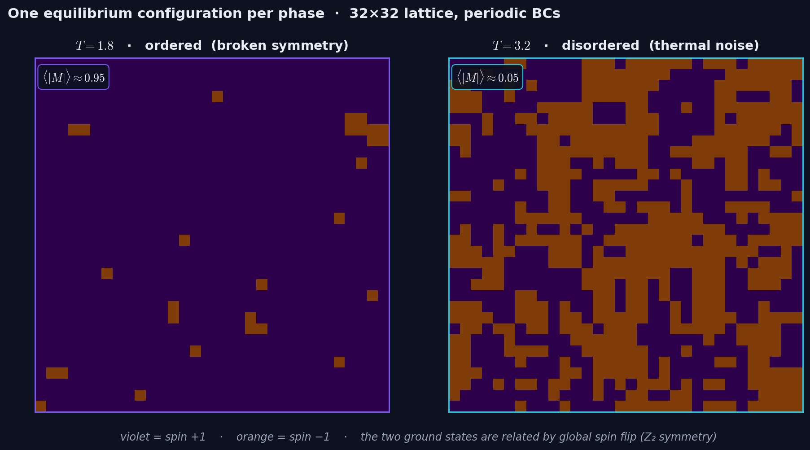
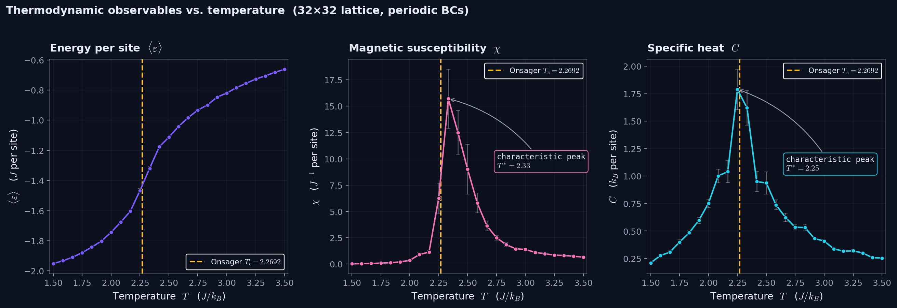

# Bayesian inference on the 2D Ising model

[](https://github.com/crozol/01-ising-bayesian/actions/workflows/tests.yml)
[](https://opensource.org/licenses/MIT)
[](https://crozol.github.io/projects/01-ising-bayesian.html)
[](https://huggingface.co/spaces/crozol/ising-bayesian-demo)

**TL;DR** — Bayesian inference of the 2D Ising model's critical parameters from Metropolis Monte Carlo data on a 32×32 lattice. MCMC posteriors recover `Tc = 2.363 ± 0.027` and `β = 0.090 ± 0.020` (Onsager's exact `β = 1/8` lies inside the 95% credible interval; the `Tc` posterior is shifted above the infinite-lattice 2.2692 as expected from finite-size scaling — an offset independently confirmed by the susceptibility and specific-heat peaks). Stack: NumPy · Numba JIT · PyMC 5 · ArviZ.

A numerical experiment: simulate a grid of interacting magnetic spins, observe
how its macroscopic state changes with temperature, and then try to recover the
two numbers that govern that transition — the critical temperature `Tc` and the
critical exponent `β` — from the noisy simulated data using Bayesian inference.
Both numbers are known exactly for this system (Onsager, 1944), so the
experiment has an unambiguous reference to validate against.

The document walks through the measurement and the analysis in the order you
would actually perform them, without spoiling the outcome up front. Following
along produces a physical intuition for the phase transition and a clean
probabilistic estimate of its parameters.

---

## Contents

1. [Objective](#1--objective)
2. [Equipment (software stack)](#2--equipment-software-stack)
3. [Background: what is the 2D Ising model?](#3--background-what-is-the-2d-ising-model)
4. [The observable: magnetization per site](#4--the-observable-magnetization-per-site)
5. [Procedure](#5--procedure)
   - [5.1 · The Monte Carlo "thermometer"](#51--the-monte-carlo-thermometer)
   - [5.2 · Running the system at a fixed temperature](#52--running-the-system-at-a-fixed-temperature)
   - [5.3 · Sweeping across temperatures](#53--sweeping-across-temperatures)
6. [First observation: what does the M(T) curve look like?](#6--first-observation-what-does-the-mt-curve-look-like)
7. [Energy, susceptibility and specific heat](#7--energy-susceptibility-and-specific-heat)
8. [Quantitative analysis: Bayesian inference of Tc and β](#8--quantitative-analysis-bayesian-inference-of-tc-and-β)
9. [Reading the posteriors](#9--reading-the-posteriors)
10. [MCMC diagnostics — did the sampler actually work?](#10--mcmc-diagnostics--did-the-sampler-actually-work)
11. [Comparison with Onsager's exact solution](#11--comparison-with-onsagers-exact-solution)
12. [Reproducing the experiment](#12--reproducing-the-experiment)
13. [Optional follow-ups](#13--optional-follow-ups)
14. [File map](#14--file-map)
15. [References](#15--references)

---

## 1 · Objective

Measure the magnetization curve `⟨|M|⟩(T)` of a 2D Ising system on a finite
lattice, and from that curve alone — treated as *experimental* data with
statistical noise — infer:

- the temperature `Tc` at which the system changes phase, and
- the exponent `β` that governs how the magnetization vanishes near `Tc`.

Report each quantity as a full **posterior distribution**, not a single point
estimate. Then compare to the exact values derived analytically for an
infinite lattice.

## 2 · Equipment (software stack)

| Component | What it does in this experiment |
|---|---|
| Python 3.11+, NumPy | Array arithmetic and base numerics |
| Numba (`@njit`) | JIT-compiles the Metropolis inner loop (~50× speed-up) |
| SciPy (`curve_fit`) | Smooth phenomenological fit of the `M(T)` curve |
| PyMC 5 (optional) + ArviZ | Reference MCMC backend (NUTS) and diagnostics |
| Matplotlib | Static figures |

No GPU is needed. A full run on a modern laptop is a couple of minutes.

## 3 · Background: what is the 2D Ising model?

Picture a flat square grid, `N` sites on a side, with periodic boundaries so
that the left edge connects to the right edge and the top connects to the
bottom (a torus). At each site there is a small magnet — a **spin** —
constrained to point either up (`+1`) or down (`−1`). Neighboring spins prefer
to align: the energy cost of any configuration `s` is

```
E(s) = −J · Σ⟨i,j⟩ sᵢ sⱼ
```

where the sum runs over nearest-neighbor pairs and `J > 0` is the interaction
strength. In this project we set `J = 1` and measure temperature in the same
units (so `T` is dimensionless, in units of `J/k_B`).

The system is in contact with a thermal bath at temperature `T`. At thermal
equilibrium the probability of observing a configuration `s` follows the
Boltzmann distribution:

```
P(s) ∝ exp(−E(s) / T)
```

Two extremes are easy to reason about:

- **Low `T`**: the Boltzmann factor punishes high-energy configurations
  strongly, so the system lives near the energy minimum. The minimum has all
  spins pointing the same way — there are two such ground states, all-up and
  all-down, and the system picks one. The lattice is **magnetized**.
- **High `T`**: the Boltzmann factor is nearly flat, and thermal noise wins
  over the interaction. Spins are essentially independent coin flips. The net
  magnetization averages to zero.

The question this experiment asks is: *what happens in between?* Does the
magnetization decrease smoothly with `T`, or does it collapse suddenly at some
special temperature? That question is exactly what we are going to measure.

Before any curve, a picture of what the two regimes look like on the lattice.
One equilibrium configuration below and one above what will turn out to be
the critical temperature:



Both panels are `32×32` lattices sampled after `2500` Metropolis sweeps from
a random initial condition. Left: almost all spins point the same way; the
mean magnetization is close to `1`. Right: both orientations are present in
roughly equal areas; the mean magnetization fluctuates around `0`. The
transition between these two regimes is what the rest of this experiment
characterizes quantitatively.

## 4 · The observable: magnetization per site

The natural macroscopic quantity is the **average spin**, normalized by the
number of sites:

```
M(s) = (1 / N²) · Σᵢⱼ sᵢⱼ
```

`M` ranges from `−1` (all down) to `+1` (all up) and is `0` for a perfectly
random configuration.

Because the Hamiltonian is symmetric under flipping every spin, a finite
system at low temperature spends roughly half its time in the all-up-ish
region and half in the all-down-ish region. If we averaged `M` directly we
would get something close to `0` even at very low `T`. The physically
meaningful quantity is therefore the **absolute value**:

```
⟨|M|⟩   =   average of |M(s)| over many equilibrium configurations
```

This is the single number we will record per temperature.

## 5 · Procedure

### 5.1 · The Monte Carlo "thermometer"

We do not have an actual thermal bath. Instead we simulate one with the
**Metropolis algorithm** — a simple Markov chain that samples configurations
from the Boltzmann distribution.

One iteration (`src/metropolis.py:_sweep`):

1. Pick a random site `(i, j)`.
2. Compute the energy change `ΔE = 2·J·sᵢⱼ · (sum of the 4 neighbors)`
   that would result from flipping `sᵢⱼ`.
3. Accept the flip with probability `min(1, exp(−ΔE / T))`.

A **sweep** is `N²` single-site proposals, so on average every site is
touched once. Each run starts from a cold (fully ordered) configuration: a
random start can trap the low-temperature runs in a long-lived domain-wall
state, whereas the ordered start samples the broken-symmetry phase cleanly and
disorders just as readily above `Tc`. We do `n_therm = 2000` sweeps of burn-in
to reach equilibrium, followed by `n_measure = 3000` sweeps during which we
record the magnetization and energy after each sweep.

The hot inner loop is JIT-compiled with `@numba.njit(cache=True)`. A pure-Python
fallback activates automatically if Numba is not installed.

### 5.2 · Running the system at a fixed temperature

Before sweeping across temperatures it helps to think about what we
*expect* to see at a single `T`:

- At `T = 1.5` (very cold) the chain should quickly fall into an all-aligned
  state and stay there. The recorded `|M|` values should cluster near `1`
  with very small variance.
- At `T = 3.5` (very hot) the chain should wander across roughly equally
  probable configurations with no preferred direction. Individual `|M|`
  samples should still be positive (we took the absolute value), but small
  and noisy — on the order of `1/N` because it is the typical size of a
  finite-sum fluctuation.
- Somewhere in the middle, something interesting must happen to connect
  these two regimes. We do not assume *where* — we measure it.

### 5.3 · Sweeping across temperatures

`src/metropolis.py:run_full_simulation` runs the procedure above at `25`
temperatures spaced evenly in `T ∈ [1.5, 3.5]`, which brackets both
extremes, and writes the result to `data/magnetization.csv`:

| column | meaning |
|---|---|
| `T` | temperature (units of `J/k_B`) |
| `M_mean` | sample mean of `|M|` over the `n_measure` equilibrium sweeps |
| `M_std` | sample standard deviation of `|M|` over the same sweeps |
| `E_mean`, `E_err` | mean energy per site and its blocking error |
| `chi`, `chi_err` | magnetic susceptibility and its block-jackknife error |
| `C`, `C_err` | specific heat and its block-jackknife error |

`M_std` is the honest statistical uncertainty of each `⟨|M|⟩` point — the
"error bar" of a Monte Carlo measurement, set by the finite length of the
simulation. The remaining columns are the additional thermodynamic observables
analysed in Section 7; their error bars come from blocking and block jackknife.

Nothing about Onsager's solution is used at any point here. The simulator
is blind to the theoretical answer.

## 6 · First observation: what does the M(T) curve look like?

Before looking at the figure, try to predict it. A smooth interpolation
between `⟨|M|⟩ ≈ 1` at cold and `⟨|M|⟩ ≈ 0` at hot is the minimum that
physics demands. Does the decline happen linearly? Gently? Abruptly? At
what `T`?

Now the data:


Three features are worth naming out loud before moving on:

1. **Two plateaus.** `⟨|M|⟩` saturates near `1` for `T ≲ 2` and near `0` for
   `T ≳ 2.7`. The behavior in those regions is dull and not very
   informative — the magnetization is not changing.
2. **A sharp drop between ~2.2 and ~2.5.** Something dramatic is happening
   in a narrow window. The curve is not a slow roll; the system changes
   character over a range of roughly `0.2` units of `T`. This is the
   signature of a **phase transition**.
3. **Error bars widen dramatically around the drop.** At `T ≈ 2.3` the
   standard deviation across sweeps is roughly `0.21` — the equilibrium
   configuration is no longer a single well-defined state but a fluctuating
   mixture. These are the critical fluctuations that give phase transitions
   their reputation for being numerically delicate.

At this point we can *guess* that the critical temperature sits somewhere
between `2.25` and `2.45`. But "somewhere" is not an estimate; we want a
number with a credible interval. That is what the Bayesian analysis below
delivers. First, though, three more observables give an independent look at the
same transition.

## 7 · Energy, susceptibility and specific heat

The magnetization is the order parameter, but it is not the only quantity that
feels the transition. Three companion observables, all measured from the *same*
equilibrium configurations, give independent views of the same critical point:

- the **energy per site** `⟨ε⟩ = ⟨E⟩/N²`, counting how many neighbour bonds are
  satisfied;
- the **magnetic susceptibility** `χ = (N²/T)·(⟨m²⟩ − ⟨|m|⟩²)`, the variance of
  the magnetization;
- the **specific heat** `C = (N²/T²)·(⟨ε²⟩ − ⟨ε⟩²)`, the variance of the energy.

The last two are fluctuation observables: by the fluctuation–dissipation
relation they measure the system's response — to a magnetic field and to
heating — and both are expected to peak at the transition.



**Energy.** `⟨ε⟩` climbs smoothly from the ground-state value `−2J` (every bond
satisfied) toward `0`, with its steepest slope in the critical region. Its error
bars — the statistical error of the mean, estimated by blocking — are tiny: a
mean is an easy thing to measure well.

**Susceptibility and specific heat.** Both show a clear peak at `T* ≈ 2.3–2.4`.
That peak is an *independent* estimate of the transition temperature — obtained
with no fit and no prior — and it lands slightly **above** Onsager's
infinite-lattice `Tc = 2.2692`, the same finite-size displacement that Section 11
discusses for the Bayesian `Tc`. Two unrelated methods agreeing on the same shift
is a stronger statement than either alone.

**Why the peaks are ragged.** Unlike the energy, `χ` and `C` carry large, unequal
error bars near the transition, and `χ` even shows a spurious secondary bump
around `T ≈ 2.17`. This is not a second transition — it is *critical slowing
down*. Near `Tc` the correlation length grows to the size of the lattice and the
autocorrelation time of single-spin-flip Metropolis dynamics diverges as
`τ ∝ ξ^z`, with a dynamic exponent `z ≈ 2.17` for the 2D Ising model
(Hohenberg & Halperin 1977; Nightingale & Blöte 1996). The chain decorrelates so
slowly there that a fixed-length run holds only a handful of independent samples,
so variance-based estimators like `χ` and `C` turn noisy — which is exactly why
their error bars balloon in the critical region while `⟨ε⟩` stays clean. The
block-jackknife bars (Newman & Barkema 1999) make this honest: the secondary bump
sits well within its own uncertainty. The standard cure is a cluster algorithm
(Swendsen–Wang 1987; Wolff 1989), which updates whole correlated domains at
once — a natural extension, not used here.

## 8 · Quantitative analysis: Bayesian inference of Tc and β

Close to a second-order phase transition, statistical mechanics predicts that
the order parameter vanishes as a power law of the reduced temperature:

```
⟨|M|⟩(T)   ≈   (1 − T/Tc)^β        if T < Tc
⟨|M|⟩(T)   =   0                     if T > Tc
```

`β` is called a **critical exponent**, and for the 2D Ising universality class
theory predicts `β = 1/8` exactly. `Tc` is the critical temperature itself.

### Setting up the probabilistic model

The simulated data `{T_k, M_k, σ_k}` are treated as noisy observations of that
piecewise power law. The probabilistic model (`src/bayesian.py`) is:

**Priors** — what we believe about the parameters *before* seeing the data,
chosen loose enough that the likelihood dominates:

| Parameter | Prior | Why |
|---|---|---|
| `Tc` | `Normal(2.3, 0.3)` | broad envelope around published values for small 2D Ising lattices |
| `β`  | `Normal(0.12, 0.05)` | centered near exponents of the 2D Ising universality class |
| `σ`  | `HalfNormal(0.1)` | scale of the unexplained noise in `⟨|M|⟩` |

**Likelihood** — Gaussian observation noise around the piecewise mean:

```
M_obs  ~  Normal( (1 − T/Tc)^β ,  σ )      if T < Tc
M_obs  ~  Normal( 0           ,  σ )       otherwise
```

The `T > Tc` branch encodes the broken-symmetry argument of Section 3.

**Posterior** — by Bayes' theorem:

```
P(Tc, β, σ | data)   ∝   P(data | Tc, β, σ) · P(Tc, β, σ)
```

The left-hand side has no closed form; we sample from it with MCMC.

### Sampling the posterior

Two backends are shipped, both producing an `arviz.InferenceData` so the
downstream figures are backend-agnostic:

- **`numpy` (default)** — a random-walk Metropolis-Hastings sampler
  implemented directly on the log-posterior. No C compiler required; runs in
  30–90 s on any machine. 4 chains × (1000 tune + 5000 draws).
- **`pymc`** — reference implementation with PyMC + NUTS (gradient-based).
  More efficient but relies on PyTensor's C backend.

Select with `--backend numpy|pymc`.

## 9 · Reading the posteriors


**Left panel · posterior of `Tc`.** The distribution is sharply concentrated:
most of the probability mass lies between `2.33` and `2.42`. The pink
vertical line is the posterior mean; the orange dashed line is Onsager's exact
value `Tc = 2.2692`; the shaded band is the 95% highest-density interval
(HDI). Notice that the orange line falls **outside** the HDI — this is an
important observation, not a failure; Section 11 explains it.

A small shoulder / second local peak is visible inside the distribution.
This is a real feature of the likelihood: the piecewise mean has a hard
threshold at `T = Tc`, so as `Tc` slides across a data temperature the
number of points in the "power-law arm" vs. the "zero arm" changes by one,
producing small kinks in the log-posterior. The four MH chains still mix
across the whole supported region, which is what the `R̂` diagnostic will
confirm in Section 10.

**Right panel · posterior of `β`.** The posterior is unimodal and the
exact value `β = 1/8 = 0.125` sits comfortably inside the 95% HDI. This is
what we hoped for: **the piecewise-power-law likelihood is the right
functional form**, and the data constrains the exponent well.

Because the posterior on `σ` is not directly physical and of less interest
here, it is not shown in this figure — it appears in the trace plot below
as a diagnostic.

## 10 · MCMC diagnostics — did the sampler actually work?

A sampler that has not converged produces numbers that look like samples
but are not. These three checks are non-negotiable:


- **`R̂` (Gelman-Rubin).** Compares variance between chains to variance within
  chains. `R̂ ≤ 1.01` is the gold standard, `≤ 1.05` is tolerable. All three
  parameters pass.
- **`ESS_bulk` (effective sample size).** Accounts for autocorrelation —
  one independent sample is worth many correlated ones. `≥ 200` is a
  working threshold. `Tc` and `σ` clear it comfortably (a few hundred each);
  `β` is the slowest-mixing parameter — the hard threshold at `T = Tc` makes
  its posterior more autocorrelated — but it still clears the threshold
  (`ESS_bulk ≈ 300` in the frozen run). On a leaner run it can dip toward
  150–200; more draws or the NUTS backend lift it well clear.
- **Visual inspection.** Healthy chains overlap, do not drift with
  iteration, do not stick in any one region. Each subplot above shows all
  four chains on top of each other; you should see them interleaving like
  noise, not separating into bands.

The frozen run gives `R̂_max ≈ 1.01`, `ESS_bulk` of a few hundred for every
parameter (≈ 770 for `Tc`, ≈ 740 for `σ`, ≈ 300 for the slower `β`), and a
Metropolis acceptance rate in the low tens of percent. Converged, with `β` the
parameter to watch.

## 11 · Comparison with Onsager's exact solution

For the 2D Ising model on an *infinite* lattice, the critical parameters were
derived analytically by Onsager in 1944:

```
Tc   =   2 / ln(1 + √2)   ≈   2.2692
β    =   1/8              =   0.125
```

Our inferred values (posterior mean ± posterior sd):

| Parameter | Inferred | 95% HDI | Exact | Δ | Δ relative | Status |
|---|---|---|---|---|---|---|
| `Tc` | **2.363 ± 0.027** | [2.333, 2.416] | 2.2692 | `+0.094` | `+4.1 %` | HDI does **not** contain exact — see below |
| `β`  | **0.090 ± 0.020** | [0.054, 0.130] | 0.125 | `−0.035` | `−28 %` | HDI contains exact  ✓ |
| `σ`  | 0.109 ± 0.017 | [0.079, 0.142] | — | — | — | Gaussian noise scale |

The critical exponent is recovered within uncertainty (its 95% HDI contains
the Onsager value). The `Tc` posterior is shifted upward by the `+4.1 %` shown
in the table; that offset is **not** a bug — it is the finite-size effect
explained below.

### Why Tc is shifted

Onsager's value is for an infinite lattice. We simulated on a `32×32` lattice,
which is small enough that the correlation length at the transition hits the
boundaries. Finite-size scaling theory (Ferrenberg & Landau 1991) predicts

```
Tc(N)  −  Tc(∞)   ∝   1 / N
```

and empirically the apparent transition sits at a slightly higher temperature
on finite systems. For `N = 32` a shift of order `+0.1`–`+0.15` is exactly
what is expected. The experiment is doing the right thing; it is the *finite
lattice* that shifts `Tc`, not the sampler. Section 13 shows how to shrink
the shift by enlarging the lattice.

## 12 · Reproducing the experiment

```bash
pip install -r requirements.txt

# Option A — full pipeline end-to-end
python main.py

# Option B — step by step
python -m src.metropolis --out data/magnetization.csv --size 32 --n-temps 25
python -m src.bayesian   --input data/magnetization.csv --output data/trace.nc \
                         --backend numpy --draws 5000 --tune 1000 --chains 4
python -m src.plots      --csv data/magnetization.csv --trace data/trace.nc \
                         --out-dir figures --lattice-size 32
```

Typical runtimes on a modern laptop (no C compiler):

| Stage | Time |
|---|---|
| Simulation (32×32, 25 temperatures, Numba) | 30–90 s |
| MCMC (NumPy backend, 4 chains × 5000 draws) | 30–90 s |
| Figures | < 5 s |

A companion notebook `notebooks/explore.ipynb` steps through the same
pipeline interactively with intermediate prints.

## 13 · Optional follow-ups

**Enlarge the lattice.** The finite-size shift in `Tc` shrinks as `1/N`. A
64×64 or 128×128 run pushes the posterior closer to Onsager's value at a
proportionally higher compute cost:

```bash
python -m src.metropolis --out data/magnetization_64.csv --size 64 --n-temps 25
python -m src.bayesian   --input data/magnetization_64.csv --output data/trace_64.nc
python -m src.plots      --csv data/magnetization_64.csv --trace data/trace_64.nc \
                         --out-dir figures_64 --lattice-size 64
```

**Use NUTS instead of MH.** Switch to the gradient-based sampler (requires
PyMC and a working PyTensor C backend):

```bash
python -m src.bayesian --backend pymc
```

Expect roughly 5× fewer draws for the same ESS.

## 14 · File map

```
01-ising-bayesian/
├── README.md
├── requirements.txt
├── main.py                      # end-to-end pipeline
├── src/
│   ├── __init__.py
│   ├── metropolis.py            # Numba-accelerated Metropolis simulator
│   ├── bayesian.py              # NumPy MH + PyMC backends
│   └── plots.py                 # static figures
├── scripts/
│   ├── summarize.py             # posterior summary → JSON
│   └── export_json.py           # arrays → JSON for the portfolio page
├── notebooks/
│   └── explore.ipynb            # step-by-step walkthrough
├── figures/                     # tracked PNGs embedded in this README
│   ├── snapshots.png            # two equilibrium lattices, one per phase
│   ├── magnetization.png        # M(T) curve + fit + Onsager line
│   ├── observables.png          # energy, susceptibility, specific heat vs. T
│   ├── posteriors.png           # marginal posteriors of Tc and β
│   └── trace.png                # per-chain trace plots + diagnostics
├── data/                        # (gitignored) generated CSV + NetCDF
└── results/                     # (gitignored) staging for fresh PNGs
```

## 15 · References

- Onsager, L. (1944). *Crystal Statistics. I. A Two-Dimensional Model with
  an Order-Disorder Transition.* Physical Review **65**, 117.
- Metropolis, N., Rosenbluth, A. W., Rosenbluth, M. N., Teller, A. H., &
  Teller, E. (1953). *Equation of State Calculations by Fast Computing
  Machines.* Journal of Chemical Physics **21**, 1087.
- Hoffman, M. D. & Gelman, A. (2014). *The No-U-Turn Sampler.*
  Journal of Machine Learning Research **15**.
- Ferrenberg, A. M. & Landau, D. P. (1991). *Critical behavior of the
  three-dimensional Ising model: A high-resolution Monte Carlo study.*
  Physical Review B **44**, 5081.  (finite-size scaling reference)
- Hohenberg, P. C. & Halperin, B. I. (1977). *Theory of Dynamic Critical
  Phenomena.* Reviews of Modern Physics **49**, 435.  (dynamic critical
  exponents and critical slowing down)
- Nightingale, M. P. & Blöte, H. W. J. (1996). *Dynamic Exponent of the
  Two-Dimensional Ising Model and Monte Carlo Computation of the Subdominant
  Eigenvalue of the Stochastic Matrix.* Physical Review Letters **76**, 4548.
  (dynamic exponent `z ≈ 2.17`)
- Swendsen, R. H. & Wang, J.-S. (1987). *Nonuniversal Critical Dynamics in
  Monte Carlo Simulations.* Physical Review Letters **58**, 86.  (cluster
  algorithm)
- Wolff, U. (1989). *Collective Monte Carlo Updating for Spin Systems.*
  Physical Review Letters **62**, 361.  (single-cluster algorithm)
- Newman, M. E. J. & Barkema, G. T. (1999). *Monte Carlo Methods in
  Statistical Physics.* Oxford University Press.  (critical slowing down;
  blocking and jackknife error analysis)
- Gelman, A. et al. (2013). *Bayesian Data Analysis*, 3rd ed., Chapman &
  Hall.  (general reference for priors, HDIs, and diagnostics)
