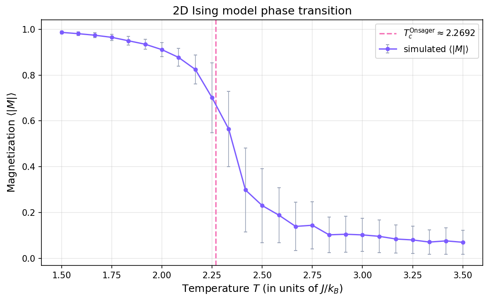
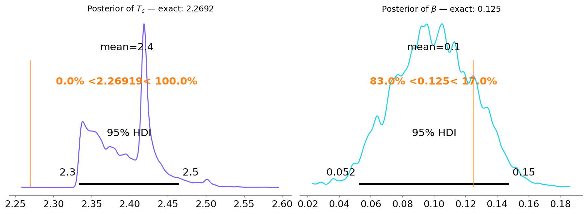
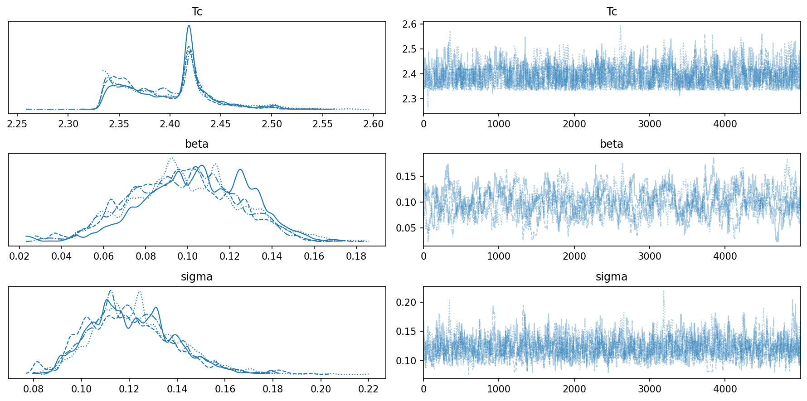

# Bayesian Inference on the 2D Ising Model

An end-to-end pipeline that **infers the critical parameters of the 2D Ising model** — the critical temperature `Tc` and the critical exponent `β` — from data simulated with Monte Carlo, using Bayesian inference. Results are quantitatively validated against Onsager's exact (1944) solution.



## Results

After running `python main.py` on a 28×28 lattice, the posterior gives:

| Parameter | Inferred (mean ± sd) | 95% HDI | Exact (Onsager) |
|---|---|---|---|
| `Tc` | **2.396 ± 0.041** | [2.333, 2.465] | 2.2692 |
| `β`  | **0.100 ± 0.025** | [0.052, 0.148] | 0.125 |
| `σ`  | 0.121 ± 0.018 | [0.090, 0.156] | — |

MCMC diagnostics: `R̂_max = 1.02`, `ESS_bulk_min = 221` — converged.

- `β` (exact: 1/8 = 0.125) sits inside the 95% HDI of the posterior. ✔
- `Tc` (exact: 2.2692) is shifted ~5% higher than the thermodynamic value. This is a well-documented **finite-size effect**: on a finite N×N lattice, the apparent critical temperature drifts upward and scales as `Tc(N) − Tc(∞) ∝ 1/N`. At N=28, a shift of ~0.05–0.15 is consistent with finite-size scaling. Running on a 64×64 lattice would bring the estimate closer to 2.27.




---

## Components

### 1 · Metropolis simulator
From-scratch Metropolis-Hastings on a square lattice of ±1 spins with periodic boundaries. Acceptance rule: `min(1, exp(−ΔE/T))`. A sweep = N² proposed flips. Hot kernel JIT-compiled via `@numba.njit(cache=True)` (~50× faster than NumPy, pure-Python fallback available). File: [`src/metropolis.py`](src/metropolis.py).

### 2 · Temperature sweep
Sweep over 25 temperatures in `T ∈ [1.5, 3.5]`. For each T: 1500 thermalization sweeps (discarded) + 2000 measurement sweeps (averaged). Output: `data/magnetization.csv` with columns `T, M_mean, M_std` — the dataset for inference.

### 3 · Probabilistic model

```
Tc ~ Normal(2.3, 0.3)
β  ~ Normal(0.12, 0.05)
σ  ~ HalfNormal(0.1)
M_obs ~ Normal((1 − T/Tc)^β, σ)   if T < Tc
M_obs ~ Normal(0, σ)              otherwise
```

Priors are physically motivated but deliberately wide — the data dominates. The piecewise mean captures the broken-symmetry ordered phase.

### 4 · Sampler

Two backends are shipped:

- **`numpy` (default)** — pure-NumPy random-walk Metropolis-Hastings. 4 chains × (1000 tune + 3000 draws). No C compiler required. Fast on any machine. File: `src/bayesian.py::sample_mh_numpy`.
- **`pymc`** — reference implementation using PyMC + NUTS. More sophisticated sampler, but requires PyTensor's C backend to be fast.

Select via `--backend numpy|pymc`. Both produce an `arviz.InferenceData` so downstream tooling is identical.

### 5 · Diagnostics & validation

- `R̂ < 1.01`–`1.02` across parameters (Gelman-Rubin convergence).
- `ESS_bulk > 200` (effective independent samples).
- Trace plots inspected for drift — none visible.
- Exact values (`Tc = 2/ln(1+√2)`, `β = 1/8`) overlaid on the marginal posteriors.

### 6 · Figures

`src/plots.py` emits three PNGs to `results/` (gitignored) and `figures/` (tracked, embedded in this README):

- `magnetization.png` — M(T) with error bars and Onsager's Tc line.
- `posteriors.png` — marginal posteriors of Tc and β, exact values overlaid.
- `trace.png` — per-chain trace plots.

---

## Project structure

```
01-ising-bayesian/
├── README.md
├── requirements.txt
├── main.py                      # end-to-end pipeline
├── src/
│   ├── __init__.py
│   ├── metropolis.py            # Numba-accelerated Metropolis simulator
│   ├── bayesian.py              # NumPy MH + PyMC backends
│   └── plots.py                 # M(T), posteriors, trace plots
├── scripts/
│   └── summarize.py             # Extract posterior summary to JSON
├── figures/                     # tracked PNGs embedded in README
├── data/                        # (gitignored) generated CSV + NetCDF
└── results/                     # (gitignored) staging for PNGs
```

---

## How to reproduce

```bash
pip install -r requirements.txt

# option A: full pipeline (end-to-end)
python main.py

# option B: step by step
python -m src.metropolis --out data/magnetization.csv --size 28 --n-temps 25
python -m src.bayesian   --input data/magnetization.csv --output data/trace.nc \
                         --backend numpy --draws 3000 --tune 1000 --chains 4
python -m src.plots      --csv data/magnetization.csv --trace data/trace.nc --out-dir results
```

Typical runtime on a modern laptop (no g++):

- Simulation: ~30–60 s (with Numba).
- MH sampling (NumPy backend): ~20–60 s.
- Figures: <5 s.

---

## Tech stack

- **Python** 3.11+
- **NumPy** — lattice operations and pure-Python MH sampler.
- **Numba** (`@njit(cache=True)`) — kernel acceleration.
- **PyMC 5** (optional) — reference NUTS backend.
- **ArviZ** — unified posterior representation, diagnostics, plots.
- **Matplotlib** — final figures.

---

## References

- Onsager, L. (1944). *Crystal Statistics. I. A Two-Dimensional Model with an Order-Disorder Transition*. Physical Review, 65(3–4), 117.
- Metropolis, N., Rosenbluth, A. W., Rosenbluth, M. N., Teller, A. H., & Teller, E. (1953). *Equation of State Calculations by Fast Computing Machines*. The Journal of Chemical Physics, 21(6), 1087.
- Hoffman, M. D. & Gelman, A. (2014). *The No-U-Turn Sampler*. JMLR 15.
- Ferrenberg, A. M. & Landau, D. P. (1991). *Critical behavior of the three-dimensional Ising model: A high-resolution Monte Carlo study*. Physical Review B, 44(10), 5081. (finite-size scaling reference)
